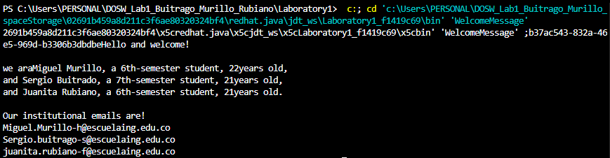
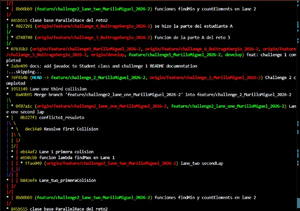
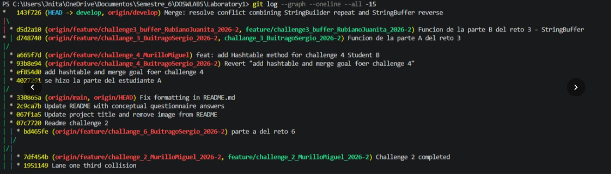
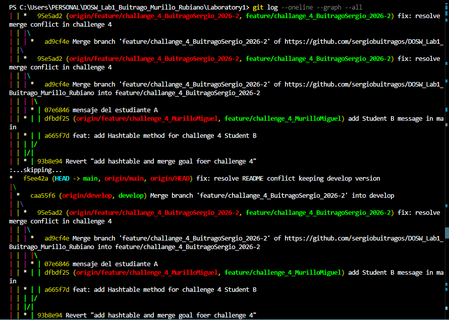

# DOSW_Lab1_Buitrago_Murillo_Rubiano

Lab 1 de Dosw

## Team Members

- Sergio Daniel Buitrago
- Miguel Angel Murillo Hurtado
- Juanita Rubiano

## Challenge Evidence

### Challenge 1 – Welcome Message

#### Evidence

#### Description
A Student class was created to store each team member's full name, age, institutional email, and current semester. A WelcomeMessage class was then implemented using Java Streams with stream(), map(), and collect() along with lambda expressions to iterate over a `List<Student>` and print a formatted welcome message for each member.

### Challenge 2 – Parallel Commit Race

#### Evidence

#### Description
A ParallelRace class was implemented using lambda-based functions to process a list of integers. Lane One implemented a findMax lambda to return the largest number. Lane Two implemented findMin and countElements lambdas to return the smallest number and total element count. Both lanes were developed on separate branches and merged, generating intentional conflicts that were resolved manually.

### Challenge 3

#### Evidence

#### Description
This challenge was completed through collaborative work using Git, simulating a real-world merge conflict between two developers. Each student created their own branch from the develop branch. The first student implemented a mysteriousEcho method that repeats a message three times using StringBuilder, while the second student implemented the same method to reverse the message using StringBuffer.

When the two branches were merged, Git generated a real merge conflict because both students had modified the same method with different implementations. The conflict was resolved manually by combining both approaches into a final version that first repeats the message three times (using StringBuilder and stream()) and then reverses the resulting string (using StringBuffer). The final method is invoked through a lambda expression using a method reference (Challenge3::mysteriousEcho).

The entire process—including the creation of independent branches, the merge conflict, and its manual resolution—is documented in the Git commit history.

### Challenge 4 – The Treasure of Duplicate Keys

#### Evidence

#### Description
A Challenge4 class was implemented using both HashMap and Hashtable to store key-value pairs of type (String, Integer), ignoring duplicate keys and preserving the first value found. A merge method combined both maps using Stream.concat(), Collectors.toMap() and TreeMap to prioritize Hashtable values on duplicates, convert all keys to uppercase, and sort them in ascending order. A merge conflict was intentionally generated and resolved during the integration of both branches.

### Challenge 5 – Battle of Sets

#### Evidence

#### Description
Two army collections were implemented using HashSet and TreeSet to store unique 
integers. The HashSet army removes all multiples of 3 using stream().filter(), 
while the TreeSet army removes all multiples of 5 using the same approach, 
maintaining natural ascending order. Both collections were then merged into a single 
TreeSet to eliminate duplicates and preserve ascending order, with results printed 
using a lambda expression with forEach()

## Conceptual Questionnaire Answers
1. Team agreements: Each student works on their own computer and branch. 
Commits must be meaningful and traceable. All challenges must be merged into 
develop before merging to main. The branch history must be preserved at all times.

2. git merge vs git rebase: git merge combines two branches creating a new 
merge commit, preserving the full history. git rebase moves or replays commits 
from one branch on top of another, resulting in a cleaner linear history but 
rewriting commit history.

3. Same line conflict: When two branches modify the same line of a file, Git 
cannot automatically decide which version to keep and generates a merge conflict. 
The developer must manually resolve it by editing the file, removing the conflict 
markers (<<<<<<<, =======, >>>>>>>), and committing the resolved version.

4. Graphical branch history: You can display the branch and merge history 
graphically in the terminal using:
git log --oneline --graph --decorate --all

5. Commit vs Push: A commit saves changes locally in the repository history. 
A push uploads those local commits to the remote repository so others can access them.

6. git stash and git stash pop: git stash temporarily saves uncommitted changes 
without committing them, allowing you to switch branches with a clean working tree. 
git stash pop restores those saved changes back to the working directory.

7. HashMap vs Hashtable: HashMap is not synchronized, allows one null key and 
multiple null values, and is faster in single-threaded environments. Hashtable is 
synchronized (thread-safe), does not allow null keys or values, and is slower due 
to its thread-safety overhead.

8. Collectors.toMap() advantages: Collectors.toMap() allows transforming a 
stream directly into a Map in a declarative and concise way. It supports key/value 
mapping functions, merge functions for duplicate keys, and custom Map suppliers, 
avoiding the verbosity and error-proneness of traditional loops.

9. stream().map() operation: stream().map() performs an intermediate 
transformation operation. It applies a function to each element of the stream and 
returns a new stream with the transformed elements, without modifying the original collection.

10. stream().filter(): stream().filter() applies a predicate (boolean condition) 
to each element and returns a new stream containing only the elements that satisfy 
the condition. It is an intermediate operation that does not modify the original collection.
